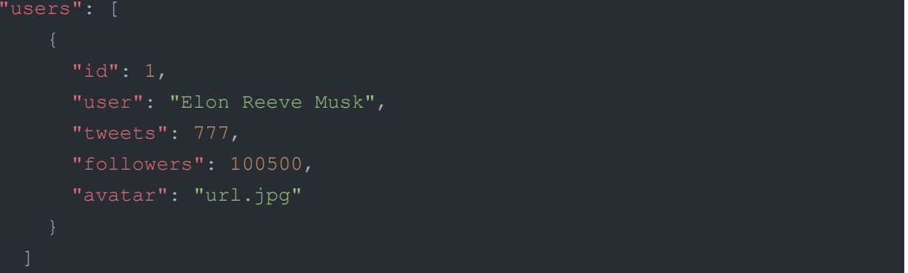

# TweeTest

TweeTest is a basic simple prototype of a web-based social media app.
Due to the app was developed as a technical test within a few days, it's functionality is currently limited to a few small features: 
- User can check the list of top 3 popular users and top 3 active users on the Homepage. The rating is based on the number of followers and tweets respectively.
- User can get a list of all users on the Tweets page and simply filter those he/she follows with the neat  filtering tool. This can be especially helpful to keep an eye out on people you follow, especially if you automatically follow everyone back like I do =)


## Demo

That's how it works:


## Features

- Intuitive and creative design
- Fullscreen mode
- Cross platform


## Tech Stack

**Client:** React + extra libs

**Server:** https://mockapi.io/


## Run Locally

Clone the project

```bash
  git clone https://github.com/iuliia-sokol/tech-test-hw
```

Go to the project directory

```bash
  cd  /name of your local folder/
```

Install dependencies

```bash
  npm install
```

Start the server

```bash
  npm start
```


## Environment Variables

To run this project, you will need to add the following environment variables to your .env.local file

`REACT_APP_BASE_URL`

You can get it after registering and launching your backend project on https://mockapi.io/

Please check out the backend structure before you start:



## Authors

The app was designed and developed by Iuliia Sokol.
